# Οδηγίες για εγγραφή σε μάθημα και αποστολή παραδοτέου

Ο πιο εύκολος τρόπος χρήσης του Github είναι μέσω της σελίδας του.

Σας επισημαίνουμε ότι οι εικόνες (**screenshots**) των οδηγιών που ακολουθούν είναι **ενδεικτικές**.

## Αρχικά δημιούργησε ένα αντίγραφο του αποθετηρίου του μαθήματος (fork)
Δημιούργησε ένα **αντίγραφο** του αποθετηρίου του μαθήματος (**fork**) στον github λογαριασμό σας.

## Δημιουργία Branch

Μετά θα πρέπει να δημιουργήσεις το προσωπικό σου Branch. Ακολούθησε τα παρακάτω βήματα :

### 1. Κάνε κλικ στον Branch selector.

###2. Δώσε ένα όνομα για το νέο Branch. Το όνομα πρέπει να είναι ο Αριθμός Μητρώου σου στα λατινικά (201XXXX).

###3. Κάνε κλικ στο create branch για να δημιουργήσεις το προσωπικό σου Branch.

## Δημιουργία φακέλου

Ακολούθησε τα παρακάτω βήματα για να δημιουργήσεις το προσωπικό σου φάκελο:

###1. Αρχικά επίλεξε το προσωπικό σου branch (201XXXX) και στη συνέχεια μπες στο φάκελο projects.

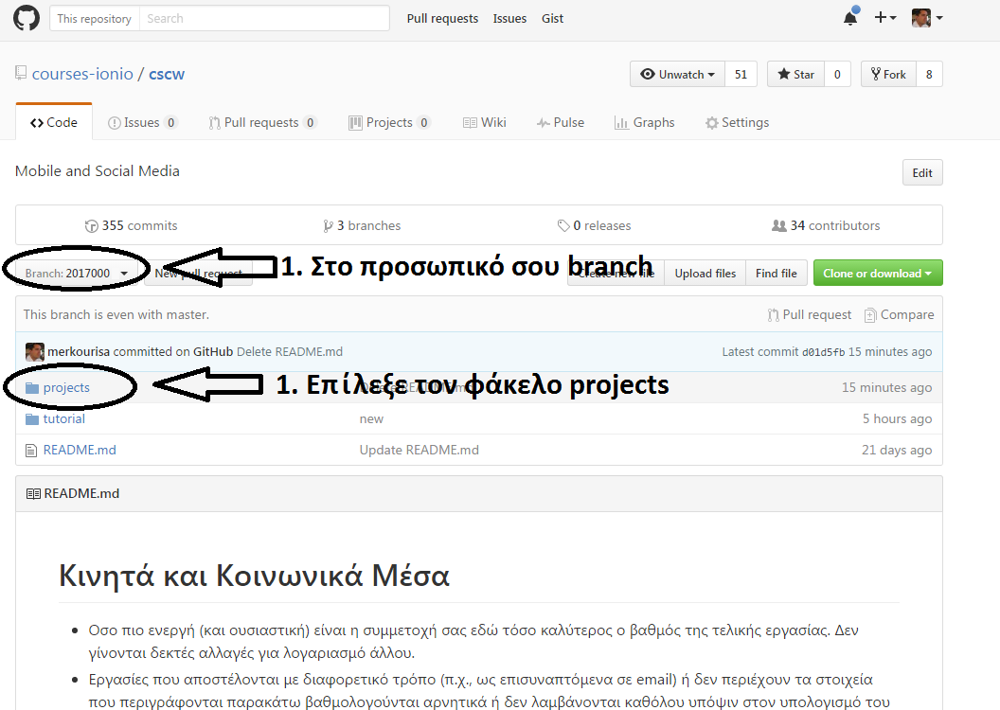

###2. Κάνε κλικ στο Create new file.

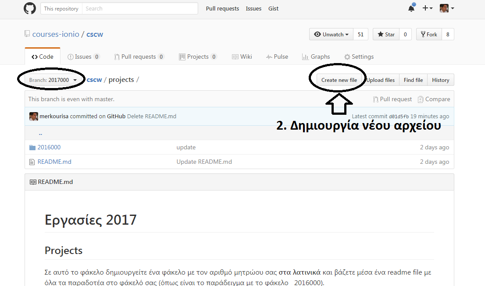

###3. Γράψε στο κενό αρχικά το όνομα του νέου φακέλου. Το όνομα του νέου φακέλου θα πρέπει να είναι ο Αριθμός Μητρώου σου στα λατινικά (Μην ξεχάσεις την / στο τέλος του ΑΜ).
###4. Γράψε το όνομα του αρχείου που θα είναι README.md.

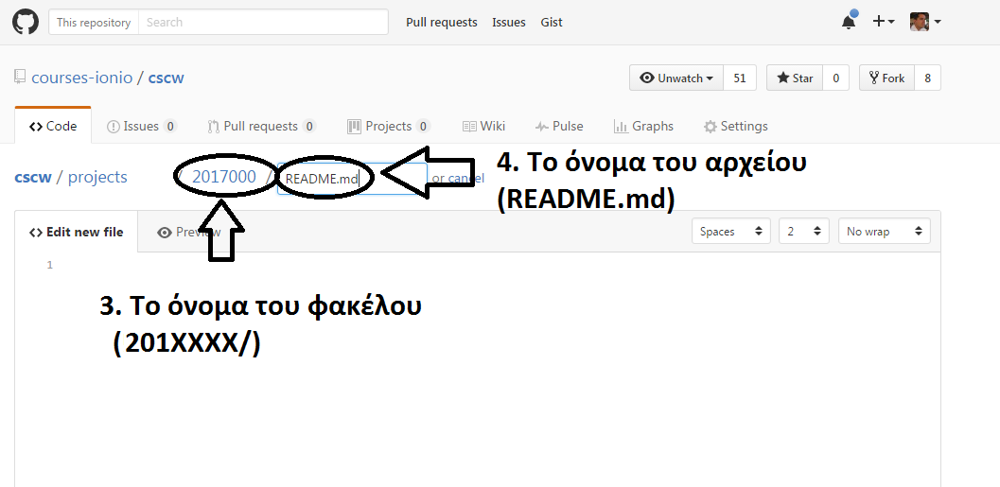

###5. Κάνε commit στο προσωπικό σου branch (201XXXX).

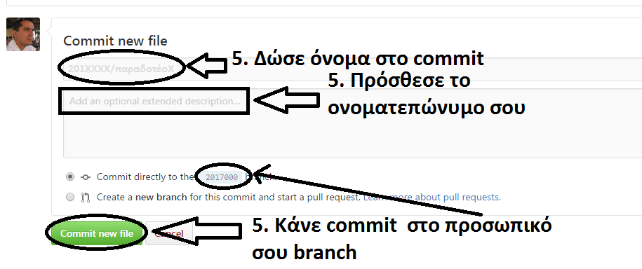

###6. Για να συγχρονιστεί το προσωπικό branch σου με το master branch πρέπει στη συνέχεια να κάνεις pull request.

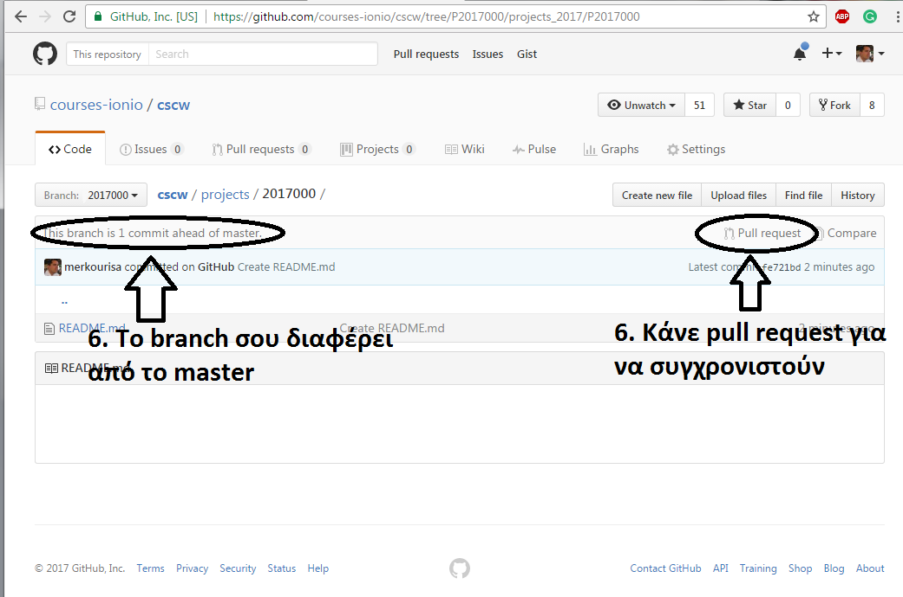

###7. Άνοιξε ένα νέο pull request με την αλλαγή που ζητάς.

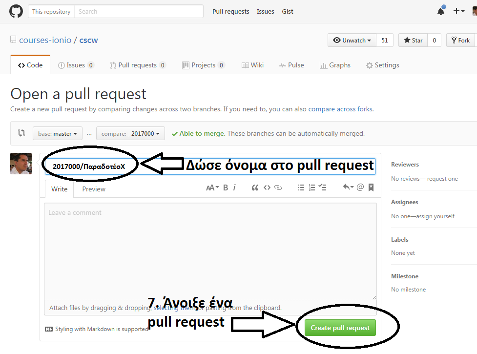

###8. Θα δημιουργηθεί ένα νέο pull request με την αλλαγή που ζητάς. Ο διαχειριστής του repository στη συνέχεια θα απαντήσει στο pull request και θα επιτρέψει να γίνει η αλλαγή και στο master branch εκτός από το προσωπικό σου branch (201XXXX) αν φυσικά δεν υπάρχει κάποιο conflict.

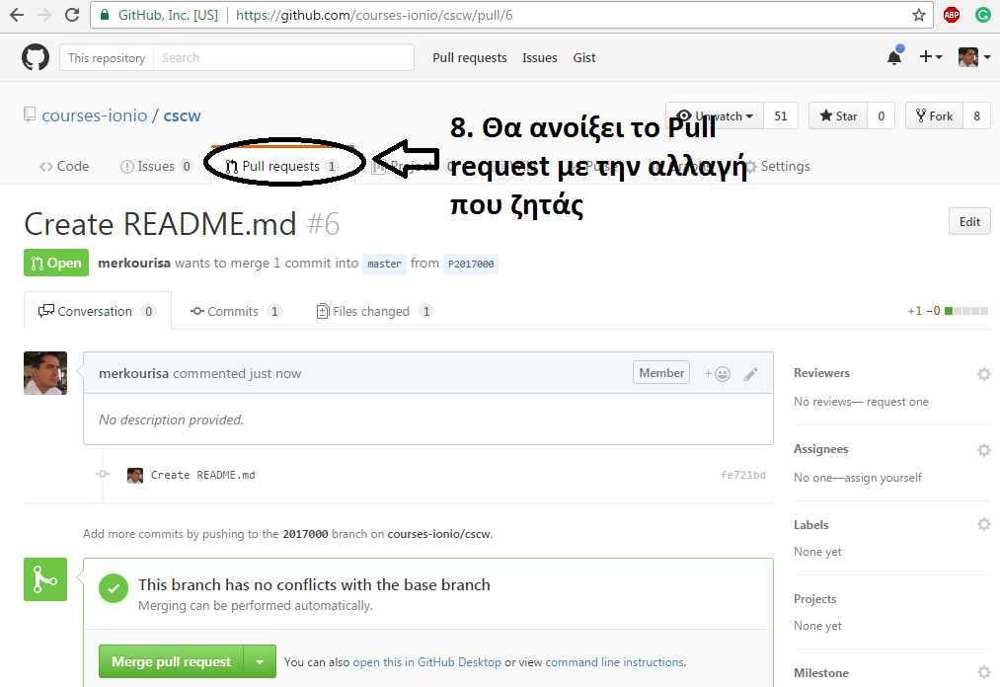

###9. Όταν ο διαχειριστής επιτρέψει την αλλαγή απαντώντας στο pull request τότε θα εμφανιστεί το αρχείο που δημιούργησες στον αντίστοιχο φάκελο και στο master branch. Μέχρι να απαντήσει ο διαχειριστής η αλλαγή θα φαίνεται μόνο στο προσωπικό σου branch (201XXXX).

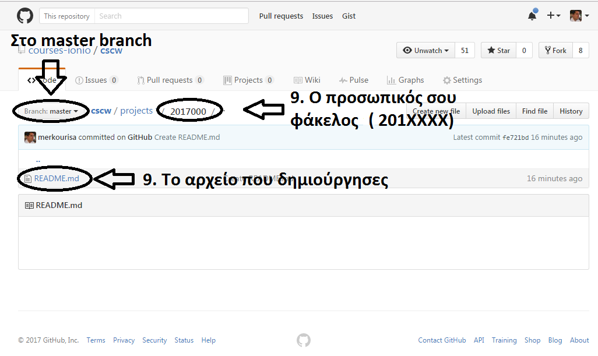

_Επιπλέον πληροφορίες για τη δημιουργία φακέλου μπορείτε να δείτε και από [εδώ](http://stackoverflow.com/questions/18773598/creating-folders-inside-github-com-repo-without-using-git)_

## Επεξεργασία README.md

Στο README.md πρέπει να γράψεις το κείμενο της εργασίας σου. Η επεξεργασία του README.md μπορεί να γίνει πάλι από τη σελίδα του Github.

Ακολούθησε τα παρακάτω βήματα για να επεξεργαστείς το αρχείο README.md:

###1. Αρχικά επίλεξε το branch σου και στη συνέχεια το αρχείο README.md που βρίσκεται στον προσωπικό σου φάκελο.

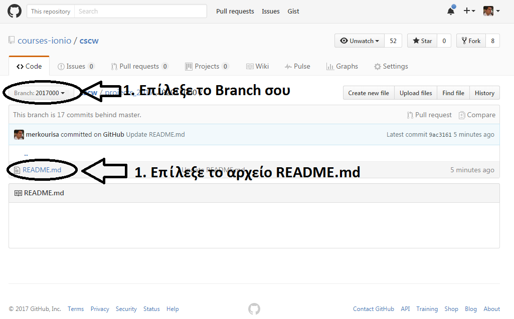

###2. Κάνε κλικ στο μολύβι (Edit this file).

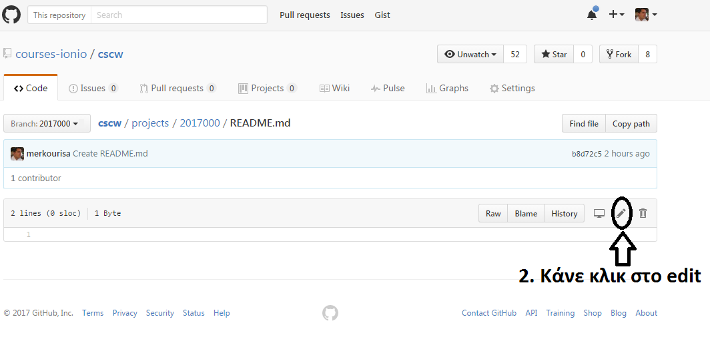

###3. Πρόσθεσε το κείμενο που θέλεις.

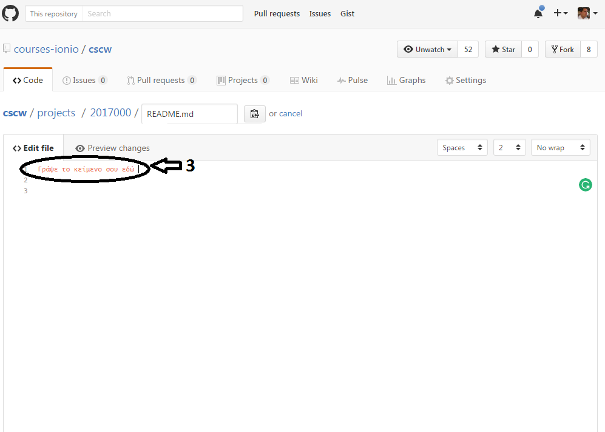

###4. Μπορείς να δεις σε προεπισκόπηση το αρχείο README.md κάνοντας κλικ στο preview changes. Κάνε commit changes στο προσωπικό σου branch (201XXXX).

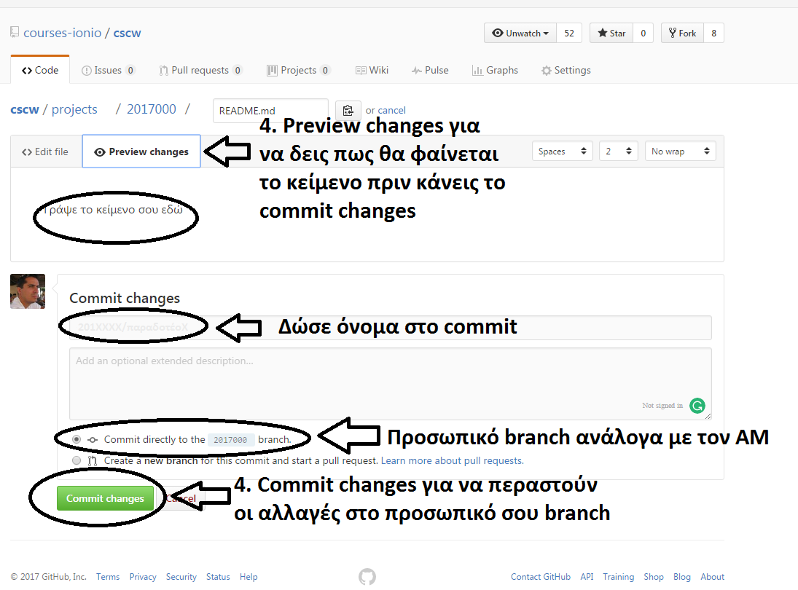

###5. Αν οι αλλαγές που έκανες θες να περαστούν και στο master branch τοτε πρέπει να δημιουργήσεις ένα νέο pull request .

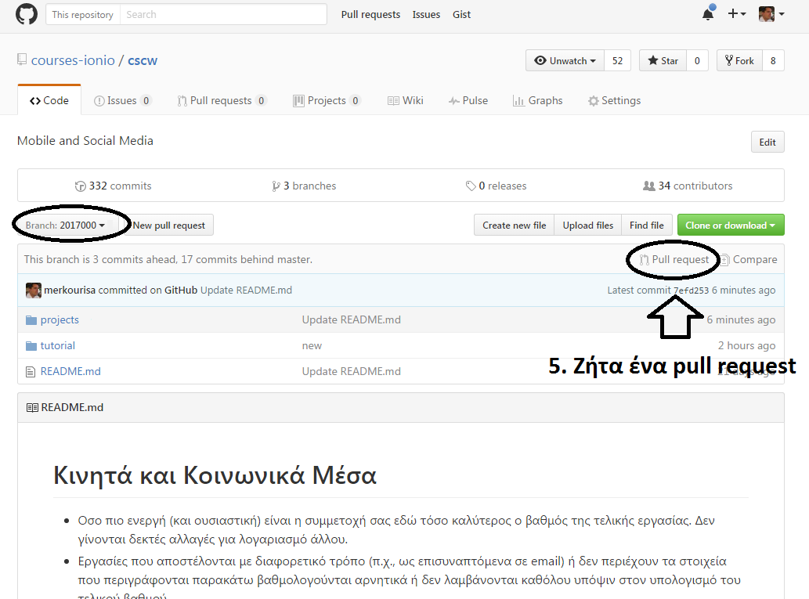

###6. Ζήτα το νέο pull request.

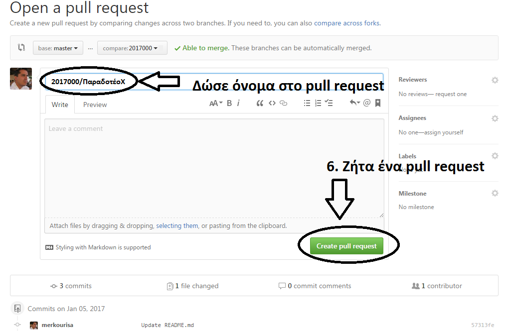

###7. Όταν ο διαχειριστής επιτρέψει τις αλλαγές απαντώντας στο pull request τότε οι αλλαγές στο README.md αρχείο θα εμφανιστούν και στο master branch. Μέχρι να απαντήσει ο διαχειριστής οι αλλαγές θα φαίνεται μόνο στο προσωπικό σου branch (201XXXX).

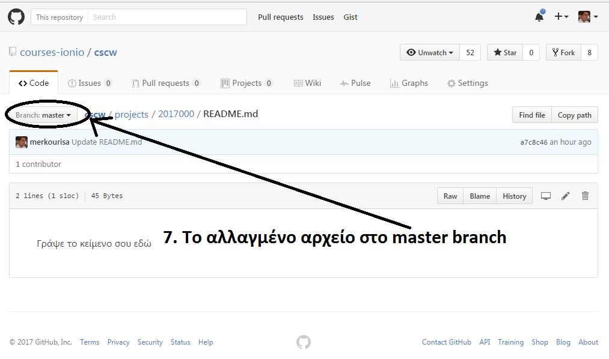

_[Ένα απλό Tutorial για τη δημιουργία του readme file/αναφορά της εργασίας σας](https://guides.github.com/features/mastering-markdown/)_

## Προσθήκη εικόνας στο README.md

Κάποιες φορές είναι απαραίτητο να ενσωματώσουμε μια εικόνα μέσα στο αρχείο README.md. 
Ακολούθησε τα παρακάτω βήματα για να προσθέσεις μια εικόνα στο αρχείο README.md:

###1. Αρχικά είναι απαραίτητο να ανεβάσεις το αρχείο της εικόνας στο φάκελο σου. Επίλεξε το προσωπικό σου branch και στη συνέχεια τον φάκελο σου.
###2. Κάνε κλικ στο Upload files

###3. Επίλεξε από τον υπολογιστή σου το αρχείο που θες να ανεβάσεις.
###4. Κάνε commit changes για να ανέβει το αρχείο στον προσωπικό σου φάκελο και στο προσωπικό σου branch.

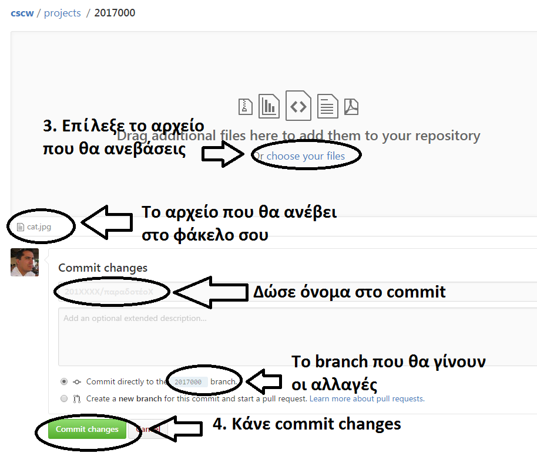

###5. Το αρχείο που ανέβασες θα εμφανίστει στο φάκελο σου.

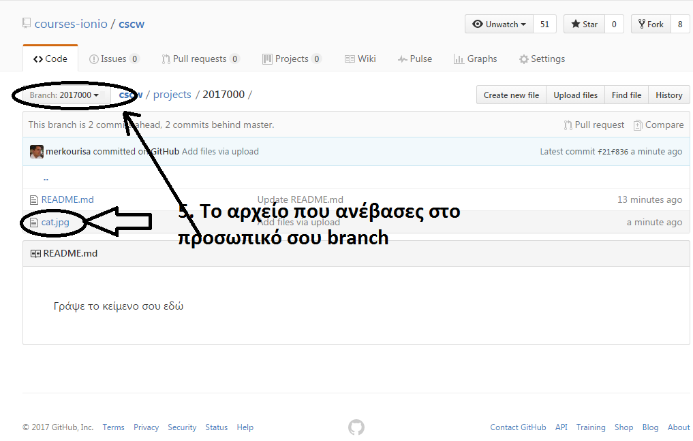

###6. Επίλεξε στη συνέχεια το αρχείο README.md και κάνε κλικ στο edit ώστε να το επεξεργαστείς. Πρόσθεσε το κατάλληλο κείμενο ώστε να ενσωματώσεις την εικόνα στο αρχείο README.md

###7. Αν ακολούθησες σωστά τα παραπάνω βήματα θα βλέπεις την εικόνα cat.jpg ενσωματωμένη στο αρχείο README.md

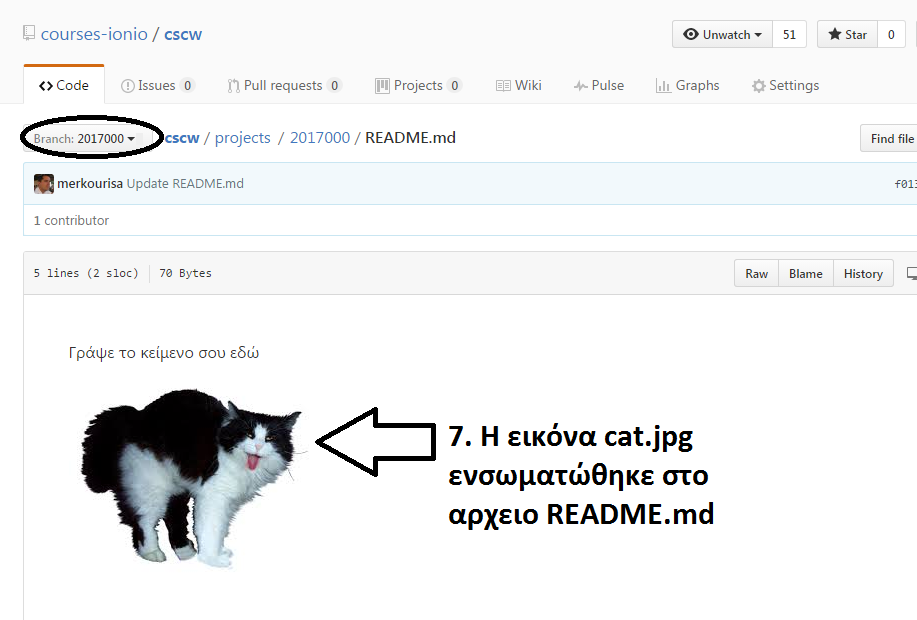

###8. Τέλος, τo μόνο που μένει είναι να συγχρονιστεί το προσωπικό σου branch (201XXXX) με το master branch, οπότε πρέπει πάλι να κάνεις pull request.

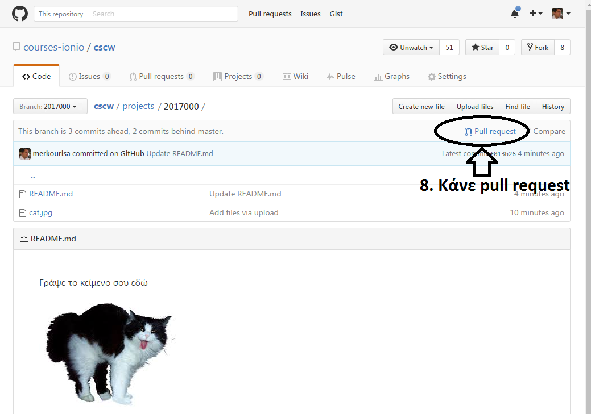

_[Επιπλέον πληροφορίες για την προσθήκη εικόνων](http://stackoverflow.com/a/11916467/1633251) στο readme file σας με τη χρήση [relative links](https://help.github.com/articles/relative-links-in-readmes/)_

## Διαγραφή αρχείου

Για να σβήσεις ένα αρχείο από το φάκελο σου απλά το επιλέγεις και πατάς delete. 

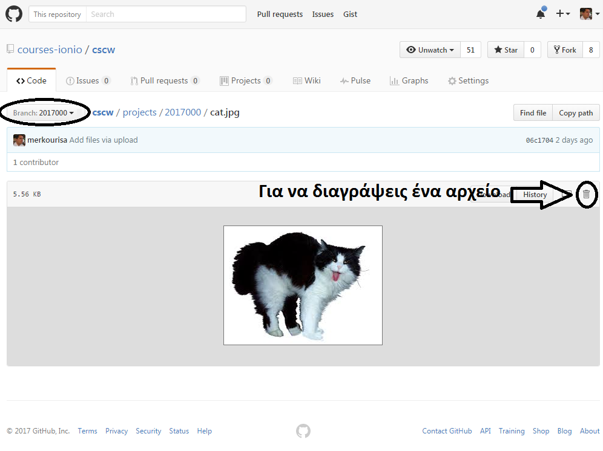

Σημείωση: Αν σβήσεις όλα τα αρχεία από τον φάκελο σου τότε θα σβηστεί και ο ίδιος ο φάκελος.

Μην ξεχνάς κάθε φορά που κάνεις αλλαγές στο προσωπικό σου branch (201XXXX) θα πρέπει οπωσδήποτε να κάνεις και pull request ώστε οι αλλαγές να περάσουν και στο master branch.

